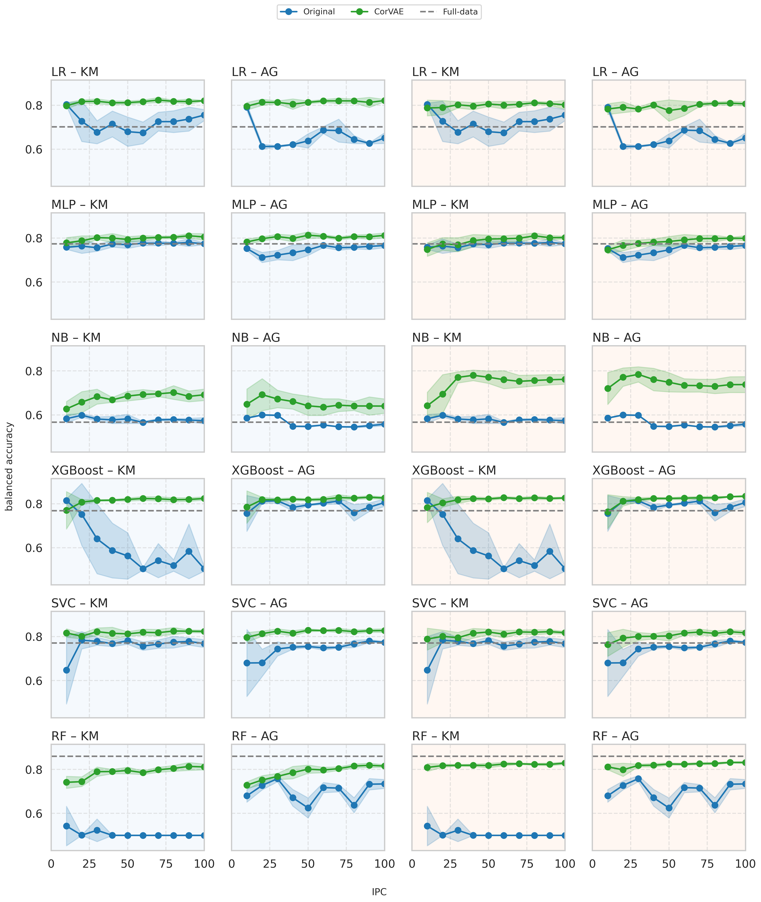

# CorVAE: Heterogeneous Data Distillation with Variational Autoencoders and Coreset Selection

This repository contains the source code for the **CorVAE** architecture, a methodology for distilling heterogeneous tabular data (with numerical and categorical columns). CorVAE employs Variational Autoencoders (VAEs) to learn a latent representation of the data, upon which coreset selection techniques are applied to identify a representative subset of samples.

The main objective is to significantly reduce the size of the training dataset without sacrificing machine learning model performance. This translates into lower computational costs, reduced training time, and decreased energy consumption, aligning with Edge Computing needs.

The methodology enables training classification models (both neural network-based and traditional) on this coreset, achieving performance comparable to that obtained with the full dataset.

## Methodology

CorVAE is based on a two-stage pipeline:

1.  **Representation Learning**: A Variational Autoencoder (VAE) with a Transformer-based architecture is trained to capture complex dependencies among tabular data features. The VAE learns to compress data into a lower-dimensional latent space.
2.  **Coreset Selection**: Various coreset techniques are applied on the latent space generated by the VAE to select an optimal subset of samples. The implemented techniques include:
    * K-Means
    * Agglomerative Clustering
    * Least Confidence
    * K-Center Greedy

Finally, the selected coreset can be used in two ways:
* **Training in the Latent Space**: Models are trained directly with the latent representations of the coreset.
* **Training in the Reconstructed Space**: Coreset samples in the latent space are decoded back to the original space to train the models.

## Repository Structure

```bash
├── data/
│   ├── adult/
│   ├── default/
│   └── shoppers/
├── results/
│   ├── checkpoint/
│   ├── curve_figures/
│   ├── effiency_figures/
│   ├── explainability_analysis/
│   └── exploratory_analysis/
├── tune_vae/
├── TDCOLER_data/
├── jobs/
├── Analysis_Datasets.ipynb
├── analisis_results.ipynb
├── Analysis_Results.ipynb
├── distill.py
├── environment.yml
├── main.py
├── models_vae.py
├── train_vae.py
└── utils.py
```

* **`main.py`**: Main script that runs the complete distillation and evaluation pipeline.
* **`utils.py`**: Functions for preprocessing, data splitting, reconstruction, and model evaluation with Optuna and cross-validation.
* **`train_vae.py`**: Script for training the Variational Autoencoder (VAE).
* **`distill.py`**: Implementation of coreset selection methods.
* **`models_vae.py`**: Definition of the Transformer-based VAE architecture.
* **`Analysis_Datasets.ipynb`**: Notebook with Exploratory Data Analysis (EDA) of the datasets used (Adult, Default, and Shopper).
* **`Analysis_Results.ipynb`**: Notebook for results analysis, computational efficiency, explainability (T-SNE, silhouette coefficient), and comparison with baselines.
* **`data/`**: Contains the datasets and their `metadata.json` configuration files.
* **`results/`**: Stores execution results, including checkpoints, metric figures, and analyses.
* **`jobs/`**: Contains execution scripts (e.g., `job_latent.sh`) and their respective logs.

## Installation

The development environment is managed with Conda. To install the dependencies, clone the repository and run the following command:

```bash
conda env create -f environment.yml
conda activate corvae
```

The Python version used is Python 3.12.

## Usage

### 1. Dataset Configuration File

To use a new dataset, you need to create a `metadata.json` file in a folder within `data/`. This file must follow the format below:

```json
{
"name": "adult",
"normalization": "z-score",
"num_col_idx": [0, 2, 4, 10, 11, 12],
"cat_col_idx": [1, 3, 5, 6, 7, 8, 9, 13],
"target_col_idx": [14],
"type": "classification",
"num_imputation": "mean",
"cat_imputation": "most_frequent",
"file": "dataset.csv",
"num_col_names": ["age", "fnlwgt", "education*num", "capital*gain", "capital*loss", "hours*per*week"],
"cat_col_names": ["workclass", "education", "marital*status", "occupation", "relationship", "race", "sex", "native*country"],
"target_col_name": "income"
}
```

### 2. VAE Hyperparameters File
A JSON file with the best hyperparameters for the VAE is required. You can use those provided in the `tune_vae/` folder as a starting point.

```json
{
"best_params": {
"max_beta": 0.0077,
"min_beta": 0.00014,
"lambda_": 0.9,
"lr_pretrain": 0.0051,
"wd_pretrain": 0,
"d_token": 8,
"n_head": 2,
"factor": 16,
"num_layers": 1
}
}
```

### 3. Running the Pipeline
Run the `main.py` script with the following arguments:

```bash
python3.12 main.py \
--metadata_path data/shoppers/metadata.json \
--distillation_space latent \
--epochs_latent 3000 \
--batch_size 4096 \
--checkpoint_path results/checkpoint/checkpoint_shoppers_Doriginal_F \
--hyperparams_vae tune_vae/tune_shoppers/best_hyperparams.json \
--kmeans_type centroid
```

`**distillation_space` Space where distillation is performed. Options: `original` (does not train the VAE) or `latent` (trains the VAE and distills in the latent space).

## Execution Output
The execution will generate a checkpoint folder (`results/checkpoint/checkpoint_shoppers_Doriginal_F` in the example) with the following structure:

`metrics.csv`: File containing metric results for each model and seed.

**Folders by distillation technique**: Contain the best hyperparameters found for each model.

**VAE folder**:

Latent spaces (`Z_pred.pt`, `Y_label.pt`).

`encoder.pt` and `decoder.pt` networks.

`runs` folder with TensorBoard logs to monitor the VAE loss.

`reconstructed_data` folder with distilled and reconstructed data for each IPC (Images Per Class) and seed.

## Metrics and Evaluation
Performance is evaluated using a broad range of classification metrics: `accuracy`, `precision`, `recall`, `f1-score`, `roc_auc`, and `balanced_accuracy`. Due to class imbalance present in industrial datasets, results are reported and analyzed primarily using **Balanced Accuracy**.

## Results
The best results were observed on heterogeneous datasets when using the **reconstructed space** (latent distillation followed by reconstruction with the VAE decoder). The **CorVAE + K-Means** combination proved to be the most effective.
Below is an example of performance curves for the Shopper dataset, comparing training in the latent space (yellow) and in the reconstructed space (blue).



## Baselines
To validate the effectiveness of CorVAE, results are compared against a baseline consisting of training the same classification models using the **full dataset**, coreset selection models in the original space, and the state-of-the-art TDColER architecture.

## Ablation Study: Transformer vs. MLP

To empirically demonstrate that the Transformer-based architecture provides the advantage on heterogeneous data, an ablation study was implemented comparing **CorVAE (VAE + Transformer)** against a **standard VAE (dense/MLP layers only)**.

### MLP-VAE Architecture

The MLP variant reuses the same `Tokenizer` and `Reconstructor` from the original CorVAE, replacing only the Transformer blocks in the encoder and decoder with multilayer perceptrons. This ensures a fair comparison where the only variable is the backbone (Transformer vs. MLP).

The relevant classes are:
- `MLP_VAE_Core`: VAE with MLP encoder/decoder.
- `MLP_ModelVAE`: Complete model (MLP_VAE_Core + Reconstructor + ClassifierHead).
- `MLP_EncoderModel` / `MLP_DecoderModel`: For standalone inference.

### Execution

**1. Select the architecture via CLI:**

```bash
python main.py \
    --metadata_path data/adult/metadata.json \
    --distillation_space latent \
    --epochs_latent 3000 \
    --batch_size 4096 \
    --checkpoint_path results/checkpoint/checkpoint_adult_MLP_Dlatent \
    --kmeans_type centroid \
    --epochs_fine_tuning_latent 0 \
    --hyperparams_vae tune_vae/tune_mlp_adult/best_hyperparams_mlp.json \
    --architecture mlp
```

**2. Search for MLP-VAE hyperparameters with Optuna:**

```bash
cd tune_vae
python tune_mlp_vae.py --dataset adult --n_trials 30 --epochs 700
```

**3. Run the full study for all 5 datasets:**

```bash
chmod +x run_ablation.sh
nohup bash run_ablation.sh > jobs/ablation_logs/ablation_full_log.txt 2>&1 &
```

The `run_ablation.sh` script runs sequentially for each dataset:
1. MLP hyperparameter search with Optuna (if they don't already exist).
2. Training + distillation with `--architecture mlp`.

Results are saved in `results/checkpoint/checkpoint_{dataset}_MLP_Dlatent/metrics.csv`.

## Limitations
Currently, the methodology has been validated on:

Binary classification tasks.

Numerical and heterogeneous (numerical and categorical) datasets.
Application to purely categorical datasets or multiclass classification tasks may require adaptations to the VAE architecture and the preprocessing pipeline.

## Acknowledgments
This work uses an adapted version of the **TabSyn** architecture, originally designed for synthetic data generation with diffusion models.